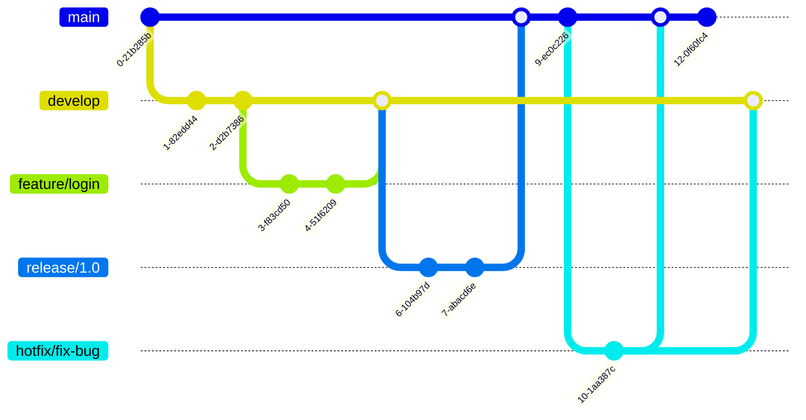
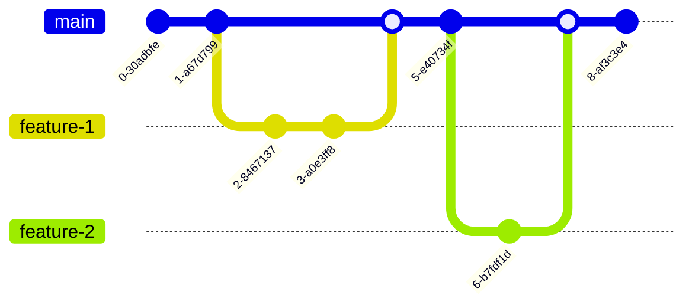
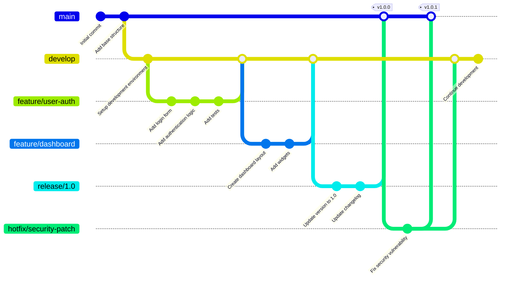

import { CircleCheck, CircleX, TriangleAlert } from "lucide-react"

### Introduction

Git is a distributed version control system that tracks changes, enables collaboration, and maintains project history. This cheatsheet covers all essential commands, advanced workflows, and best practices for both beginners and experienced developers, turning Git into a powerful productivity tool.

-----

### 1\. Basic Git Commands

This section covers the fundamental commands required for daily Git usage.

| Command | Description |
| :--- | :--- |
| `git init` | Initializes a new Git repository in the current directory. |
| `git clone <url>` | Clones a remote repository to your local machine, including all history and branches. |
| `git clone --depth 1 <url>` | Shallow clone with only the latest commit (faster for large repos). |
| `git clone --branch <branch> <url>` | Clones a specific branch from the remote repository. |
| `git status` | Shows the state of the working directory and staging area, including which files are modified, staged, or untracked. |
| `git status -s` | Short status format for quick viewing. |
| `git add <file>` | Stages a file for the next commit. |
| `git add .` | Stages all changes in the current directory for the next commit. |
| `git add -A` | Stages all changes in the entire repository (including deletions). |
| `git add -p` | **Interactive staging:** Review and stage changes in chunks (hunks). |
| `git commit -m "message"` | Commits staged changes with a single-line message. |
| `git commit -am "message"` | Stages all tracked files and commits them in one command. |
| `git commit --amend` | Modifies the last commit (change message or add forgotten files). |
| `git commit --amend --no-edit` | Adds staged changes to the previous commit without changing the message. |
| `git commit` | Opens a text editor to write a more detailed, multi-line commit message. |
| `git log` | Displays the commit history of the current branch. |
| `git log --oneline` | Displays a condensed, single-line version of the commit history. |
| `git log --graph --oneline --all` | Shows a visual graph of all branch history. |
| `git log --since="2 weeks ago"` | Shows commits from the last 2 weeks. |
| `git log --author="John"` | Shows commits by a specific author. |
| `git log --grep="fix"` | Searches commit messages for a keyword. |
| `git log -p` | Shows commit history with full diffs. |
| `git log --stat` | Shows commit history with file change statistics. |
| `git log --follow <file>` | Shows the history of a file, even through renames. |
| `git diff` | Shows differences between the working directory and the staging area. |
| `git diff --staged` | Shows differences between the staging area and the last commit. |
| `git diff <branch1>..<branch2>` | Shows differences between two branches. |
| `git diff <commit1> <commit2>` | Shows differences between two commits. |
| `git diff --name-only` | Shows only the names of changed files. |
| `git diff --color-words` | Shows word-level differences (better for prose). |
| `git show <commit-hash>` | Shows details of a specific commit. |
| `git show <commit>:<file>` | Shows a specific file from a specific commit. |
| `git remote -v` | Lists all configured remote repositories. |
| `git fetch` | Downloads new branches and changes from the remote repository without integrating them into your local branch. |
| `git fetch --all` | Fetches from all configured remotes. |
| `git fetch --prune` | Removes references to deleted remote branches. |
| `git pull` | A shortcut for `git fetch` followed by `git merge`. It downloads changes and immediately merges them. |
| `git pull --rebase` | Pulls changes and rebases your commits on top instead of merging. |
| `git push` | Pushes your local commits to the remote repository. |
| `git push -u origin <branch>` | Pushes a branch and sets upstream tracking. |
| `git push --force-with-lease` | Safer force push that won't overwrite others' work. |
| `git push --all` | Pushes all branches to remote. |
| `git push --tags` | Pushes all tags to remote. |

-----

### 2\. Git Configuration

Customize Git to work the way you prefer.

#### **Global Configuration**

```bash
# Set your identity
git config --global user.name "Your Name"
git config --global user.email "your.email@example.com"

# Set default editor
git config --global core.editor "code --wait"  # VS Code
git config --global core.editor "vim"          # Vim
git config --global core.editor "nano"         # Nano

# Set default branch name
git config --global init.defaultBranch main

# Enable colored output
git config --global color.ui auto

# Set merge tool
git config --global merge.tool vimdiff

# Set diff tool
git config --global diff.tool vimdiff

# Configure line endings (Windows)
git config --global core.autocrlf true

# Configure line endings (Mac/Linux)
git config --global core.autocrlf input

# Enable credential caching (15 minutes)
git config --global credential.helper cache

# Enable credential caching (custom timeout)
git config --global credential.helper 'cache --timeout=3600'
```

#### **Repository-Specific Configuration**

```bash
# Use --local flag or omit --global
git config user.email "work.email@company.com"
```

#### **View Configuration**

```bash
# List all settings
git config --list

# List global settings
git config --global --list

# Show specific setting
git config user.name

# Show where setting is defined
git config --show-origin user.name

# Edit config file directly
git config --global --edit
```

-----

### 3\. Branching and Merging

Branches are the core of the Git workflow, allowing for parallel development.

#### **Basic Branch Operations**

| Command | Description |
| :--- | :--- |
| `git branch` | Lists all local branches. |
| `git branch -a` | Lists all branches (local and remote). |
| `git branch -r` | Lists all remote branches. |
| `git branch <branch-name>` | Creates a new branch. |
| `git branch -m <old> <new>` | Renames a branch. |
| `git branch -d <branch-name>` | Deletes a merged branch. |
| `git branch -D <branch-name>` | Force-deletes an unmerged branch. |
| `git branch -vv` | Shows branch tracking information. |
| `git checkout <branch-name>` | Switches to an existing branch. |
| `git checkout -b <branch-name>` | Creates and switches to a new branch. |
| `git checkout -b <branch> <remote>/<branch>` | Creates a local branch from a remote branch. |
| `git switch <branch-name>` | Modern command to switch branches (Git 2.23+). |
| `git switch -c <branch-name>` | Creates and switches to a new branch (Git 2.23+). |
| `git restore <file>` | Restores a file from the index (Git 2.23+). |

#### **Merging Strategies**

```bash
# Standard merge (creates merge commit)
git merge <branch>

# Fast-forward merge only (fails if not possible)
git merge --ff-only <branch>

# Always create a merge commit (no fast-forward)
git merge --no-ff <branch>

# Squash all commits into one before merging
git merge --squash <branch>

# Abort a merge in progress
git merge --abort

# Specify merge strategy
git merge -s recursive <branch>
git merge -s ours <branch>        # Keep our version
git merge -s theirs <branch>      # (Not a real strategy, use -X theirs)
git merge -X theirs <branch>      # Prefer their changes in conflicts
git merge -X ours <branch>        # Prefer our changes in conflicts
```

#### **Branch Tracking**

```bash
# Set upstream for current branch
git branch --set-upstream-to=origin/<branch>

# Shorter version
git branch -u origin/<branch>

# Push and set upstream
git push -u origin <branch>

# Show tracking branches
git branch -vv
```

#### **GitFlow Workflow Diagram**

This diagram illustrates a more complex, but robust, branching strategy used in large teams.



#### **GitHub Flow Diagram**

A simpler workflow for continuous deployment.



-----

### 4\. Undoing Changes

Mistakes happen. Git provides multiple ways to undo changes safely.

#### **Working Directory Changes**

| Command | Description |
| :--- | :--- |
| `git checkout -- <file>` | Discards unstaged changes in a file (older syntax). |
| `git restore <file>` | Discards unstaged changes in a file (Git 2.23+). |
| `git restore --source=HEAD~1 <file>` | Restores file from a specific commit. |
| `git clean -n` | **Dry run:** Shows which untracked files would be removed. |
| `git clean -f` | Removes untracked files. |
| `git clean -fd` | Removes untracked files and directories. |
| `git clean -fX` | Removes only ignored files. |
| `git clean -fx` | Removes untracked and ignored files. |

#### **Staging Area Changes**

| Command | Description |
| :--- | :--- |
| `git reset HEAD <file>` | Unstages a staged file (older syntax). |
| `git restore --staged <file>` | Unstages a staged file (Git 2.23+). |
| `git reset` | Unstages all staged files. |

#### **Commit History Changes**

| Command | Description |
| :--- | :--- |
| `git commit --amend` | Modifies the last commit. |
| `git reset --soft HEAD~1` | Undoes the last commit but keeps changes staged. |
| `git reset --mixed HEAD~1` | Default reset. Undoes commit and unstages changes. |
| `git reset --hard HEAD~1` | **DANGEROUS!** Undoes commit and permanently discards changes. |
| `git reset --hard origin/main` | Resets local branch to match remote (discards local commits). |
| `git revert <commit-hash>` | Creates a new commit that undoes a previous commit. |
| `git revert -n <commit-hash>` | Reverts changes but doesn't commit (allows editing). |
| `git revert <commit1>..<commit2>` | Reverts a range of commits. |
| `git revert --abort` | Aborts a revert in progress. |

#### **Reset vs Revert Comparison**

| Aspect | Reset | Revert |
| :--- | :--- | :--- |
| **History** | Rewrites history | Preserves history |
| **Safe for shared branches** | <CircleX className="inline h-4 w-4 text-red-500" /> No | <CircleCheck className="inline h-4 w-4 text-green-500" /> Yes |
| **Creates new commit** | No | Yes |
| **Best for** | Local changes | Shared branches |

-----

### 5\. Stashing

The `stash` command is a powerful tool for temporarily saving changes you aren't ready to commit.

#### **Basic Stashing**

```bash
# Save current changes
git stash

# Save with a descriptive message
git stash save "WIP: working on login feature"

# Stash including untracked files
git stash -u

# Stash including untracked and ignored files
git stash -a

# Stash only unstaged changes
git stash --keep-index
```

#### **Applying Stashes**

```bash
# List all stashes
git stash list

# Show stash contents
git stash show
git stash show -p          # Show full diff
git stash show stash@{1}   # Show specific stash

# Apply the latest stash (keeps stash)
git stash apply

# Apply a specific stash
git stash apply stash@{2}

# Apply and remove the latest stash
git stash pop

# Apply to a specific stash and remove it
git stash pop stash@{1}
```

#### **Managing Stashes**

```bash
# Drop a specific stash
git stash drop stash@{2}

# Drop the latest stash
git stash drop

# Clear all stashes
git stash clear

# Create a branch from a stash
git stash branch <branch-name> stash@{1}
```

-----

### 6\. Remote Repositories

#### **Managing Remotes**

| Command | Description |
| :--- | :--- |
| `git remote` | Lists all remotes. |
| `git remote -v` | Lists all remotes with URLs. |
| `git remote add <name> <url>` | Adds a new remote. |
| `git remote add origin <url>` | Adds the primary remote named `origin`. |
| `git remote remove <name>` | Removes a remote. |
| `git remote rename <old> <new>` | Renames a remote. |
| `git remote set-url <name> <url>` | Changes the URL of a remote. |
| `git remote show <name>` | Shows detailed information about a remote. |
| `git remote prune origin` | Removes stale remote-tracking branches. |

#### **Fetching and Pulling**

```bash
# Fetch from default remote
git fetch

# Fetch from specific remote
git fetch origin

# Fetch from all remotes
git fetch --all

# Fetch and prune deleted branches
git fetch --prune

# Pull with merge (default)
git pull origin main

# Pull with rebase
git pull --rebase origin main

# Pull all branches
git pull --all
```

#### **Pushing**

```bash
# Push to default remote and branch
git push

# Push to specific remote and branch
git push origin main

# Push and set upstream
git push -u origin main

# Push all branches
git push --all

# Push tags
git push --tags

# Force push (dangerous!)
git push --force

# Safer force push
git push --force-with-lease

# Delete remote branch
git push origin --delete <branch-name>

# Push to a different branch name
git push origin local-branch:remote-branch
```

#### **Working with Forks**

```bash
# Add upstream remote (original repo)
git remote add upstream <original-repo-url>

# Fetch from upstream
git fetch upstream

# Merge upstream changes into your fork
git checkout main
git merge upstream/main

# Rebase your work on upstream
git rebase upstream/main
```

-----

### 7\. Rebasing

Rebasing is a powerful operation that rewrites commit history to keep it linear and clean.

#### **Basic Rebasing**

```bash
# Rebase current branch on top of main
git checkout feature/login
git rebase main

# Rebase with conflict resolution
git rebase main
# ... resolve conflicts ...
git add <file>
git rebase --continue

# Skip a commit during rebase
git rebase --skip

# Abort rebase
git rebase --abort
```

#### **Interactive Rebase**

Interactive rebase allows you to edit, reorder, squash, or delete commits.

```bash
# Rebase last 3 commits
git rebase -i HEAD~3

# Rebase from a specific commit
git rebase -i <commit-hash>

# Rebase from root
git rebase -i --root
```

**Interactive Rebase Commands:**

```
pick   = use commit
reword = use commit, but edit the commit message
edit   = use commit, but stop for amending
squash = use commit, but meld into previous commit
fixup  = like squash, but discard this commit's log message
drop   = remove commit
```

**Example Interactive Rebase Session:**

```bash
pick a1b2c3d Add login feature
squash e4f5g6h Fix typo in login
reword h7i8j9k Add logout feature
drop k0l1m2n Remove debug code
```

#### **Rebase Best Practices**

<TriangleAlert className="inline h-4 w-4 text-yellow-500" /> **Never rebase commits that have been pushed to a shared branch!**

<CircleCheck className="inline h-4 w-4 text-green-500" /> **Safe to rebase:**
- Local commits not yet pushed
- Feature branches only you're working on
- Cleaning up before creating a pull request

<CircleX className="inline h-4 w-4 text-red-500" /> **Don't rebase:**
- The main/master branch
- Commits others are building on
- Public history

-----

### 8\. Tags and Releases

Tags mark specific points in history as important, typically for releases.

#### **Creating Tags**

```bash
# Lightweight tag (just a pointer to a commit)
git tag v1.0.0

# Annotated tag (recommended for releases)
git tag -a v1.0.0 -m "Release version 1.0.0"

# Tag a specific commit
git tag -a v1.0.0 <commit-hash> -m "Release version 1.0.0"

# Tag with GPG signature
git tag -s v1.0.0 -m "Signed release 1.0.0"
```

#### **Viewing Tags**

```bash
# List all tags
git tag

# List tags matching a pattern
git tag -l "v1.*"

# Show tag details
git show v1.0.0

# Show tag with verification
git tag -v v1.0.0
```

#### **Managing Tags**

```bash
# Delete local tag
git tag -d v1.0.0

# Delete remote tag
git push origin --delete v1.0.0

# Push specific tag
git push origin v1.0.0

# Push all tags
git push origin --tags

# Push annotated tags only
git push origin --follow-tags

# Checkout a tag (detached HEAD state)
git checkout tags/v1.0.0

# Create a branch from a tag
git checkout -b version1 v1.0.0
```

#### **Semantic Versioning**

Follow [SemVer](https://semver.org/) for version tags:

```
v1.0.0 = MAJOR.MINOR.PATCH

MAJOR: Incompatible API changes
MINOR: New features (backwards compatible)
PATCH: Bug fixes (backwards compatible)
```

Examples:
- `v1.0.0` - Initial release
- `v1.1.0` - Added new feature
- `v1.1.1` - Bug fix
- `v2.0.0` - Breaking changes

-----

### 9\. Git Aliases (Productivity Tips)

Aliases save time and make Git more intuitive.

#### **Basic Aliases**

```bash
# Status
git config --global alias.st status
git config --global alias.s 'status -s'

# Checkout
git config --global alias.co checkout
git config --global alias.cob 'checkout -b'

# Branch
git config --global alias.br branch
git config --global alias.branches 'branch -a'

# Commit
git config --global alias.cm commit
git config --global alias.cma 'commit -am'
git config --global alias.amend 'commit --amend'

# Diff
git config --global alias.df diff
git config --global alias.dfs 'diff --staged'
git config --global alias.dfw 'diff --color-words'

# Log
git config --global alias.l 'log --oneline'
git config --global alias.lg "log --graph --pretty=format:'%Cred%h%Creset -%C(yellow)%d%Creset %s %Cgreen(%cr) %C(bold blue)<%an>%Creset' --abbrev-commit"
git config --global alias.last 'log -1 HEAD'
```

#### **Advanced Aliases**

```bash
# Undo last commit
git config --global alias.undo 'reset HEAD~1 --mixed'

# Unstage all
git config --global alias.unstage 'reset HEAD --'

# Show contributors
git config --global alias.contributors 'shortlog -sn'

# Show aliases
git config --global alias.aliases "config --get-regexp '^alias\.'"

# Stash shortcuts
git config --global alias.sth 'stash'
git config --global alias.sthp 'stash pop'

# Pretty log
git config --global alias.tree "log --graph --decorate --pretty=oneline --abbrev-commit --all"

# Show branches sorted by last modified
git config --global alias.recent "branch --sort=-committerdate"

# Find commits by message
git config --global alias.find "log --all --grep"

# Show current branch
git config --global alias.current "branch --show-current"

# Delete merged branches
git config --global alias.cleanup "!git branch --merged | grep -v '\\*\\|main\\|master\\|develop' | xargs -n 1 git branch -d"
```

-----

### 10\. Advanced Git Techniques

#### **Cherry-Picking**

Apply specific commits from one branch to another.

```bash
# Cherry-pick a single commit
git cherry-pick <commit-hash>

# Cherry-pick multiple commits
git cherry-pick <commit1> <commit2>

# Cherry-pick a range of commits
git cherry-pick <commit1>^..<commit2>

# Cherry-pick without committing
git cherry-pick -n <commit-hash>

# Cherry-pick and edit commit message
git cherry-pick -e <commit-hash>

# Continue after resolving conflicts
git cherry-pick --continue

# Abort cherry-pick
git cherry-pick --abort
```

#### **Bisecting (Finding Bugs)**

Binary search through commit history to find when a bug was introduced.

```bash
# Start bisecting
git bisect start

# Mark current commit as bad
git bisect bad

# Mark a known good commit
git bisect good <commit-hash>

# Git will checkout a commit in the middle
# Test it, then mark as good or bad
git bisect good   # If the bug doesn't exist
git bisect bad    # If the bug exists

# Git repeats until it finds the first bad commit

# End bisecting
git bisect reset

# Automate bisecting with a script
git bisect start HEAD v1.0
git bisect run ./test-script.sh
```

#### **Blame (Finding Who Changed What)**

```bash
# Show who last modified each line
git blame <file>

# Show from specific line range
git blame -L 10,20 <file>

# Show with email addresses
git blame -e <file>

# Ignore whitespace changes
git blame -w <file>

# Show commit details
git blame -c <file>
```

#### **Reflog (Recovery Tool)**

Reflog records every change to HEAD, allowing you to recover "lost" commits.

```bash
# Show reflog
git reflog

# Show reflog for specific branch
git reflog show <branch>

# Recover a deleted commit
git reflog
# Find the commit hash
git checkout <commit-hash>
git checkout -b recovery-branch

# Recover deleted branch
git reflog
# Find the last commit on deleted branch
git checkout -b <branch-name> <commit-hash>

# Undo a hard reset
git reset --hard HEAD@{1}

# Clean reflog
git reflog expire --expire=now --all
git gc --prune=now
```

#### **Worktrees**

Work on multiple branches simultaneously without stashing or cloning.

```bash
# Add a worktree
git worktree add ../my-feature feature/my-feature

# Add worktree for new branch
git worktree add -b hotfix/urgent ../hotfix

# List all worktrees
git worktree list

# Remove worktree
git worktree remove ../my-feature

# Prune worktrees
git worktree prune
```

#### **Submodules**

Include other Git repositories within your repository.

```bash
# Add a submodule
git submodule add <repository-url> <path>

# Clone a repository with submodules
git clone --recursive <repository-url>

# Initialize submodules after cloning
git submodule init
git submodule update

# Update all submodules to latest
git submodule update --remote

# Update and init in one command
git submodule update --init --recursive

# Remove a submodule
git submodule deinit <path>
git rm <path>
rm -rf .git/modules/<path>
```

#### **Subtrees**

An alternative to submodules for including external repositories.

```bash
# Add a subtree
git subtree add --prefix=<directory> <repository-url> <branch> --squash

# Pull updates from subtree
git subtree pull --prefix=<directory> <repository-url> <branch> --squash

# Push changes to subtree
git subtree push --prefix=<directory> <repository-url> <branch>

# Split subtree into separate branch
git subtree split --prefix=<directory> -b <new-branch>
```

-----

### 11\. Git Hooks

Hooks are scripts that run automatically at certain points in the Git workflow.

#### **Common Hooks**

| Hook | When It Runs |
| :--- | :--- |
| `pre-commit` | Before `git commit` |
| `prepare-commit-msg` | Before commit message editor opens |
| `commit-msg` | After commit message is entered |
| `post-commit` | After `git commit` completes |
| `pre-push` | Before `git push` |
| `pre-rebase` | Before `git rebase` |
| `post-checkout` | After `git checkout` |
| `post-merge` | After `git merge` |

#### **Hook Location**

Hooks are located in `.git/hooks/` directory.

#### **Example: Pre-commit Hook**

```bash
#!/bin/sh
# .git/hooks/pre-commit

# Run linter
npm run lint
if [ $? -ne 0 ]; then
    echo "Linting failed. Commit aborted."
    exit 1
fi

# Run tests
npm test
if [ $? -ne 0 ]; then
    echo "Tests failed. Commit aborted."
    exit 1
fi

exit 0
```

Make it executable:
```bash
chmod +x .git/hooks/pre-commit
```

#### **Example: Commit Message Hook**

```bash
#!/bin/sh
# .git/hooks/commit-msg

commit_msg_file=$1
commit_msg=$(cat "$commit_msg_file")

# Check for ticket number
if ! echo "$commit_msg" | grep -qE "\[TICKET-[0-9]+\]"; then
    echo "Error: Commit message must include ticket number [TICKET-XXX]"
    exit 1
fi

exit 0
```

#### **Hook Management Tools**

- **Husky**: Popular npm package for Git hooks
- **pre-commit**: Framework for managing multi-language pre-commit hooks
- **lefthook**: Fast multi-language Git hooks manager

-----

### 12\. Conflict Resolution

#### **Understanding Conflicts**

Conflicts occur when Git can't automatically merge changes.

```bash
# During merge or rebase, conflicts appear as:
<<<<<<< HEAD
Your current changes
=======
Incoming changes
>>>>>>> branch-name
```

#### **Resolving Conflicts**

```bash
# Step 1: Identify conflicted files
git status

# Step 2: Open and manually resolve conflicts in each file

# Step 3: Mark as resolved
git add <file>

# Step 4: Complete the merge/rebase
git commit          # For merge
git rebase --continue   # For rebase

# Alternative: Abort the operation
git merge --abort
git rebase --abort
```

#### **Merge Tools**

```bash
# Use configured merge tool
git mergetool

# List available merge tools
git mergetool --tool-help

# Configure merge tool
git config --global merge.tool vimdiff
git config --global merge.tool meld
git config --global merge.tool kdiff3
git config --global merge.tool p4merge
```

#### **Conflict Resolution Strategies**

```bash
# Keep our version
git checkout --ours <file>

# Keep their version
git checkout --theirs <file>

# Merge with strategy preference
git merge -X ours <branch>      # Prefer our changes
git merge -X theirs <branch>    # Prefer their changes

# Show both versions
git show :1:<file>  # Common ancestor
git show :2:<file>  # Our version
git show :3:<file>  # Their version
```

-----

### 13\. Git Security & Signing

#### **GPG Commit Signing**

Sign your commits to verify authenticity.

```bash
# Generate GPG key
gpg --full-generate-key

# List GPG keys
gpg --list-secret-keys --keyid-format=long

# Configure Git to use GPG key
git config --global user.signingkey <key-id>

# Sign a commit
git commit -S -m "Signed commit"

# Always sign commits
git config --global commit.gpgsign true

# Sign a tag
git tag -s v1.0.0 -m "Signed tag"

# Verify a signed commit
git verify-commit <commit-hash>

# Verify a signed tag
git verify-tag v1.0.0

# Show signature in log
git log --show-signature
```

#### **SSH Commit Signing (Git 2.34+)**

```bash
# Configure SSH signing
git config --global gpg.format ssh
git config --global user.signingkey ~/.ssh/id_ed25519.pub

# Sign commits with SSH
git config --global commit.gpgsign true
```

-----

### 14\. Large Files & LFS

Git Large File Storage (LFS) handles large files efficiently.

#### **Installing Git LFS**

```bash
# Install (varies by OS)
brew install git-lfs        # macOS
apt-get install git-lfs     # Ubuntu
choco install git-lfs       # Windows

# Initialize
git lfs install
```

#### **Using Git LFS**

```bash
# Track file types
git lfs track "*.psd"
git lfs track "*.mp4"
git lfs track "*.zip"

# Track specific file
git lfs track "large-file.bin"

# View tracked patterns
git lfs track

# View tracked files
git lfs ls-files

# Untrack pattern
git lfs untrack "*.psd"

# Fetch LFS files
git lfs fetch

# Pull LFS files
git lfs pull

# Push LFS files
git lfs push origin main --all
```

#### **`.gitattributes` for LFS**

```
*.psd filter=lfs diff=lfs merge=lfs -text
*.ai filter=lfs diff=lfs merge=lfs -text
*.mp4 filter=lfs diff=lfs merge=lfs -text
*.zip filter=lfs diff=lfs merge=lfs -text
```

-----

### 15\. `.gitignore` Patterns

#### **Basic Patterns**

```
# Ignore specific file
secret.txt

# Ignore all files with extension
*.log
*.tmp

# Ignore directory
node_modules/
dist/
build/

# Ignore files in any directory
**/logs
**/temp

# Ignore files except specific ones
*.env
!.env.example

# Ignore files only in root
/config.local

# Ignore based on pattern
*-backup.*
temp-*
```

#### **Common `.gitignore` Templates**

**Node.js:**
```
node_modules/
npm-debug.log
.env
.env.local
dist/
build/
.DS_Store
```

**Python:**
```
__pycache__/
*.py[cod]
*$py.class
.Python
env/
venv/
.env
*.egg-info/
dist/
build/
```

**Java:**
```
*.class
*.jar
*.war
target/
.gradle/
build/
.idea/
*.iml
```

#### **Global Gitignore**

```bash
# Create global gitignore
git config --global core.excludesfile ~/.gitignore_global

# Add common patterns
echo ".DS_Store" >> ~/.gitignore_global
echo "Thumbs.db" >> ~/.gitignore_global
echo ".idea/" >> ~/.gitignore_global
echo ".vscode/" >> ~/.gitignore_global
```

#### **Check Ignore Rules**

```bash
# Check why a file is ignored
git check-ignore -v <file>

# List all ignored files
git ls-files --others --ignored --exclude-standard
```

-----

### 16\. Git Performance & Optimization

#### **Repository Maintenance**

```bash
# Garbage collection
git gc

# Aggressive garbage collection
git gc --aggressive --prune=now

# Verify repository integrity
git fsck

# Show repository size
git count-objects -vH

# Prune unreachable objects
git prune

# Optimize repository
git repack -ad

# Clean up stale data
git remote prune origin
git fetch --prune
```

#### **Reducing Repository Size**

```bash
# Find large files in history
git rev-list --objects --all | \
  git cat-file --batch-check='%(objecttype) %(objectname) %(objectsize) %(rest)' | \
  sed -n 's/^blob //p' | \
  sort --numeric-sort --key=2 | \
  tail -n 10

# Remove file from history (use BFG Repo-Cleaner or git-filter-repo)
# Install git-filter-repo
pip install git-filter-repo

# Remove file from all history
git filter-repo --path <file-to-remove> --invert-paths

# Remove files larger than 1MB
git filter-repo --strip-blobs-bigger-than 1M
```

#### **Shallow Clones**

```bash
# Clone with limited history
git clone --depth 1 <url>

# Deepen a shallow clone
git fetch --unshallow

# Fetch more commits
git fetch --depth=100
```

#### **Sparse Checkout**

Work with only a subset of files in a large repository.

```bash
# Enable sparse checkout
git sparse-checkout init

# Set which directories to include
git sparse-checkout set <dir1> <dir2>

# Add more directories
git sparse-checkout add <dir3>

# Show current sparse checkout
git sparse-checkout list

# Disable sparse checkout
git sparse-checkout disable
```

-----

### 17\. Troubleshooting & Recovery

#### **Common Problems**

**Problem: Detached HEAD**
```bash
# Check status
git status

# Create branch from current state
git checkout -b temp-branch

# Or return to previous branch
git checkout <branch-name>
```

**Problem: Accidentally committed to wrong branch**
```bash
# On wrong branch, copy the commit hash
git log -1

# Move to correct branch
git checkout correct-branch
git cherry-pick <commit-hash>

# Return to wrong branch and remove commit
git checkout wrong-branch
git reset --hard HEAD~1
```

**Problem: Lost commits after reset**
```bash
# Find the lost commit
git reflog

# Recover it
git checkout <commit-hash>
git checkout -b recovery-branch
```

**Problem: Merge went wrong**
```bash
# Abort merge in progress
git merge --abort

# Undo completed merge
git reset --hard HEAD~1

# Or reset to before merge
git reset --hard ORIG_HEAD
```

**Problem: Need to change commit message**
```bash
# Last commit
git commit --amend

# Older commit (interactive rebase)
git rebase -i HEAD~3
# Change 'pick' to 'reword' for commits to edit
```

**Problem: Committed sensitive data**
```bash
# Remove from last commit
git reset --soft HEAD~1
git restore --staged <file>
rm <file>
git commit -c ORIG_HEAD

# Remove from history
git filter-repo --path <file> --invert-paths
git push --force
```

**Problem: Large file preventing push**
```bash
# Remove from last commit
git rm --cached <large-file>
git commit --amend

# Set up Git LFS for future
git lfs install
git lfs track "*.large"
```

#### **Fixing a Corrupted Repository**

```bash
# Verify repository
git fsck --full

# Try to recover
git fsck --lost-found

# Clone fresh copy and copy .git folder
# (Last resort)
```

-----

### 18\. Advanced Workflows

#### **Feature Branch Workflow**

```bash
# Create feature branch
git checkout -b feature/new-feature

# Work and commit
git add .
git commit -m "Add new feature"

# Keep updated with main
git fetch origin
git rebase origin/main

# Push feature
git push -u origin feature/new-feature

# Create Pull Request
# After approval, merge and delete
git checkout main
git pull
git branch -d feature/new-feature
```

#### **Release Workflow**

```bash
# Create release branch
git checkout -b release/1.5.0 develop

# Bump version, update changelog
git commit -am "Bump version to 1.5.0"

# Merge to main
git checkout main
git merge --no-ff release/1.5.0

# Tag release
git tag -a v1.5.0 -m "Release 1.5.0"

# Merge back to develop
git checkout develop
git merge --no-ff release/1.5.0

# Delete release branch
git branch -d release/1.5.0

# Push everything
git push origin main develop --tags
```

#### **Hotfix Workflow**

```bash
# Create hotfix from main
git checkout -b hotfix/critical-bug main

# Fix and commit
git commit -am "Fix critical bug"

# Merge to main
git checkout main
git merge --no-ff hotfix/critical-bug
git tag -a v1.5.1 -m "Hotfix 1.5.1"

# Merge to develop
git checkout develop
git merge --no-ff hotfix/critical-bug

# Cleanup
git branch -d hotfix/critical-bug
git push origin main develop --tags
```

#### **Monorepo Workflow**

```bash
# Structure
# /project-root
#   /app-1
#   /app-2
#   /shared-lib

# Filter history for specific directory
git log -- app-1/

# Sparse checkout for specific apps
git sparse-checkout set app-1 shared-lib

# Separate commits by scope
git commit -m "app-1: Add feature"
git commit -m "shared-lib: Update utility"
```

-----

### 19\. Commit Message Best Practices

#### **Conventional Commits**

```
<type>[optional scope]: <description>

[optional body]

[optional footer(s)]
```

**Types:**
- `feat`: New feature
- `fix`: Bug fix
- `docs`: Documentation changes
- `style`: Code style changes (formatting, etc.)
- `refactor`: Code refactoring
- `perf`: Performance improvements
- `test`: Adding or updating tests
- `build`: Build system changes
- `ci`: CI/CD changes
- `chore`: Other changes (dependencies, etc.)

**Examples:**
```
feat(auth): add OAuth2 login support

fix(api): correct user validation logic

docs(readme): update installation instructions

refactor(database): optimize query performance

feat(ui): add dark mode toggle

BREAKING CHANGE: removed deprecated API endpoint
```

#### **Seven Rules of Great Commit Messages**

1. Separate subject from body with blank line
2. Limit subject line to 50 characters
3. Capitalize the subject line
4. Do not end subject line with period
5. Use imperative mood ("Add feature" not "Added feature")
6. Wrap body at 72 characters
7. Use body to explain what and why, not how

**Good Example:**
```
Add user authentication middleware

Previously, routes were unprotected and any user could
access sensitive data. This commit adds JWT-based
authentication middleware to protect API routes.

The middleware checks for valid tokens and returns
401 Unauthorized for invalid or missing tokens.

Fixes #123
```

-----

### 20\. GitHub/GitLab/Bitbucket Specific

#### **Pull Requests / Merge Requests**

```bash
# Create feature branch
git checkout -b feature/my-feature

# Push to remote
git push -u origin feature/my-feature

# Create PR on GitHub
gh pr create --title "Add new feature" --body "Description"

# Update PR
git push origin feature/my-feature

# Review changes
gh pr diff

# Merge PR
gh pr merge --squash

# Delete branch after merge
git branch -d feature/my-feature
git push origin --delete feature/my-feature
```

#### **GitHub CLI Examples**

```bash
# Install gh (GitHub CLI)
brew install gh

# Authenticate
gh auth login

# Create repository
gh repo create my-repo --public

# Clone repository
gh repo clone owner/repo

# Create issue
gh issue create --title "Bug report" --body "Description"

# List PRs
gh pr list

# Checkout PR
gh pr checkout 123

# Review PR
gh pr review --approve

# View repository
gh repo view --web
```

#### **GitLab CI Integration**

```yaml
# .gitlab-ci.yml
stages:
  - test
  - build
  - deploy

test:
  stage: test
  script:
    - npm install
    - npm test

build:
  stage: build
  script:
    - npm run build
  artifacts:
    paths:
      - dist/

deploy:
  stage: deploy
  script:
    - ./deploy.sh
  only:
    - main
```

-----

### 21\. Git Internals (Advanced)

#### **Understanding Git Objects**

```bash
# Show object type
git cat-file -t <hash>

# Show object content
git cat-file -p <hash>

# List all objects
git rev-list --objects --all

# Show object size
git cat-file -s <hash>
```

#### **Git Directory Structure**

```
.git/
├── HEAD              # Points to current branch
├── config            # Repository configuration
├── description       # Repository description
├── hooks/            # Hook scripts
├── info/             # Exclude patterns
├── objects/          # All git objects (commits, trees, blobs)
├── refs/             # References (branches, tags)
│   ├── heads/        # Local branches
│   ├── remotes/      # Remote branches
│   └── tags/         # Tags
├── logs/             # Reflogs
└── index             # Staging area
```

#### **Plumbing Commands**

```bash
# Low-level commands for advanced operations

# Hash a file
git hash-object <file>

# Create blob object
echo 'content' | git hash-object -w --stdin

# Update index
git update-index --add <file>

# Write tree object
git write-tree

# Create commit object
echo 'commit message' | git commit-tree <tree-hash>

# Show symbolic references
git symbolic-ref HEAD

# Read tree
git read-tree <tree-hash>
```

-----

### 22\. Collaboration Best Practices

#### **Code Review Guidelines**

<CircleCheck className="inline h-4 w-4 text-green-500" /> **Do:**
- Review code promptly
- Be constructive and specific
- Ask questions instead of making demands
- Approve when satisfied
- Test locally if possible

<CircleX className="inline h-4 w-4 text-red-500" /> **Don't:**
- Be condescending or rude
- Nitpick formatting (use linters instead)
- Review too fast without understanding
- Approve blindly

#### **Branch Naming Conventions**

```
feature/user-authentication
feature/TICKET-123-add-login
bugfix/fix-memory-leak
bugfix/TICKET-456-correct-validation
hotfix/critical-security-patch
release/v1.5.0
docs/update-readme
refactor/optimize-database-queries
test/add-integration-tests
```

#### **Team Workflows**

**Small Teams (2-5 developers):**
- Feature branches off `main`
- Direct merges with reviews
- Tag releases

**Medium Teams (5-20 developers):**
- GitFlow or GitHub Flow
- Required code reviews
- CI/CD automation
- Protected branches

**Large Teams (20+ developers):**
- Trunk-based development
- Feature flags
- Automated testing and deployment
- Monorepo or multi-repo strategy

-----

### 23\. Continuous Integration

#### **GitHub Actions Example**

```yaml
# .github/workflows/ci.yml
name: CI

on:
  push:
    branches: [ main, develop ]
  pull_request:
    branches: [ main ]

jobs:
  test:
    runs-on: ubuntu-latest

    steps:
    - uses: actions/checkout@v3

    - name: Setup Node.js
      uses: actions/setup-node@v3
      with:
        node-version: '18'
        cache: 'npm'

    - name: Install dependencies
      run: npm ci

    - name: Run linter
      run: npm run lint

    - name: Run tests
      run: npm test

    - name: Build
      run: npm run build

    - name: Upload coverage
      uses: codecov/codecov-action@v3
```

-----

### 24\. Migration Strategies

#### **Migrate from SVN to Git**

```bash
# Clone SVN repository
git svn clone <svn-url> --no-metadata -s

# Or with specific branches
git svn clone <svn-url> -T trunk -b branches -t tags

# Convert SVN tags to Git tags
git for-each-ref refs/remotes/tags | while read ref; do
  tag=$(echo $ref | sed 's#refs/remotes/tags/##')
  git tag $tag $ref
done

# Add Git remote
git remote add origin <git-url>
git push -u origin --all
git push -u origin --tags
```

#### **Migrate from Mercurial to Git**

```bash
# Install hg-fast-export
git clone https://github.com/frej/fast-export.git

# Create Git repo
git init git-repo
cd git-repo

# Import from Mercurial
../fast-export/hg-fast-export.sh -r /path/to/hg/repo

# Add remote and push
git remote add origin <git-url>
git push -u origin --all
git push -u origin --tags
```

-----

### 25\. Useful Tools & Resources

#### **GUI Clients**

- **GitKraken** - Cross-platform, beautiful UI
- **SourceTree** - Free, from Atlassian
- **GitHub Desktop** - Simple, GitHub-focused
- **Tower** - Professional, powerful features
- **GitX** - macOS, lightweight
- **Sublime Merge** - From Sublime Text creators

#### **CLI Enhancements**

```bash
# Install tig (text-mode interface)
brew install tig

# Install lazygit (terminal UI)
brew install lazygit

# Install git-extras
brew install git-extras

# Install diff-so-fancy (better diffs)
npm install -g diff-so-fancy
git config --global core.pager "diff-so-fancy | less --tabs=4 -RFX"
```

#### **Helpful Aliases & Functions**

```bash
# Add to ~/.bashrc or ~/.zshrc

# Git status shortcut
alias gs='git status'
alias ga='git add'
alias gc='git commit'
alias gp='git push'
alias gl='git pull'
alias gd='git diff'

# Undo last commit
alias gundo='git reset --soft HEAD~1'

# Current branch name
alias gbr='git branch --show-current'

# Delete merged branches
alias gclean='git branch --merged | grep -v "\*" | xargs -n 1 git branch -d'

# Interactive log
alias glog='git log --graph --oneline --all --decorate'

# Function to create and checkout branch
gnew() {
  git checkout -b "$1"
}

# Function to commit with conventional commit format
gcommit() {
  git commit -m "$1: $2"
}
```

#### **Learning Resources**

- **Official Git Documentation**: https://git-scm.com/doc
- **Pro Git Book** (free): https://git-scm.com/book
- **GitHub Learning Lab**: https://lab.github.com
- **Atlassian Git Tutorials**: https://www.atlassian.com/git/tutorials
- **Git Immersion**: https://gitimmersion.com
- **Learn Git Branching**: https://learngitbranching.js.org
- **Oh Shit, Git!?!**: https://ohshitgit.com

-----

### 26\. Complete Workflow Example

Here's a complete workflow from start to finish:

```bash
# 1. Clone repository
git clone https://github.com/company/project.git
cd project

# 2. Create feature branch
git checkout -b feature/user-profile

# 3. Make changes
# ... edit files ...

# 4. Check status
git status

# 5. Review changes
git diff

# 6. Stage changes selectively
git add -p

# 7. Commit with good message
git commit -m "feat(profile): add user profile page

- Create profile component
- Add API integration
- Include avatar upload
- Add unit tests

Closes #234"

# 8. Keep updated with main
git fetch origin
git rebase origin/main

# 9. Resolve conflicts if any
git add <conflicted-files>
git rebase --continue

# 10. Push to remote
git push -u origin feature/user-profile

# 11. Create pull request (using GitHub CLI)
gh pr create --title "Add user profile page" \
  --body "Implements user profile functionality as described in #234"

# 12. Address review comments
# ... make changes ...
git add .
git commit -m "refactor: address PR feedback"
git push

# 13. After approval, squash and merge
gh pr merge --squash

# 14. Clean up
git checkout main
git pull
git branch -d feature/user-profile
git remote prune origin
```

-----

### 27\. Cheat Diagram for Complete Workflow



-----

### 28\. Quick Reference Card

| Category | Command | Description |
| :--- | :--- | :--- |
| **Setup** | `git config --global user.name "Name"` | Set username |
| | `git config --global user.email "email"` | Set email |
| **Create** | `git init` | Initialize repository |
| | `git clone <url>` | Clone repository |
| **Changes** | `git status` | Check status |
| | `git add <file>` | Stage file |
| | `git commit -m "msg"` | Commit changes |
| | `git diff` | Show changes |
| **Branches** | `git branch` | List branches |
| | `git branch <name>` | Create branch |
| | `git checkout <branch>` | Switch branch |
| | `git merge <branch>` | Merge branch |
| **Remote** | `git remote -v` | List remotes |
| | `git fetch` | Download changes |
| | `git pull` | Fetch and merge |
| | `git push` | Upload changes |
| **Undo** | `git reset HEAD <file>` | Unstage file |
| | `git checkout -- <file>` | Discard changes |
| | `git revert <commit>` | Revert commit |
| **Inspect** | `git log` | View history |
| | `git show <commit>` | Show commit |
| | `git blame <file>` | Show who changed what |

-----

### 29\. Summary

Git is a powerful distributed version control system that, when used correctly, dramatically improves code quality, collaboration, and project management. This expanded cheatsheet covers:

- <CircleCheck className="inline h-4 w-4 text-green-500" /> **Fundamentals**: Basic commands for everyday use
- <CircleCheck className="inline h-4 w-4 text-green-500" /> **Configuration**: Customizing Git for your workflow
- <CircleCheck className="inline h-4 w-4 text-green-500" /> **Branching**: Parallel development strategies
- <CircleCheck className="inline h-4 w-4 text-green-500" /> **Collaboration**: Working effectively with teams
- <CircleCheck className="inline h-4 w-4 text-green-500" /> **Advanced Techniques**: Rebasing, cherry-picking, bisecting
- <CircleCheck className="inline h-4 w-4 text-green-500" /> **Recovery**: Fixing mistakes and recovering lost work
- <CircleCheck className="inline h-4 w-4 text-green-500" /> **Security**: Signing commits and managing sensitive data
- <CircleCheck className="inline h-4 w-4 text-green-500" /> **Performance**: Optimizing large repositories
- <CircleCheck className="inline h-4 w-4 text-green-500" /> **Integration**: CI/CD and platform-specific features
- <CircleCheck className="inline h-4 w-4 text-green-500" /> **Best Practices**: Commit messages, workflows, code review

### Key Takeaways

1. **Commit Often**: Small, focused commits are easier to understand and revert
2. **Write Good Messages**: Future you (and your team) will thank you
3. **Use Branches**: Never work directly on main/master
4. **Pull/Rebase Regularly**: Avoid painful merge conflicts
5. **Review Before Pushing**: Always check `git status` and `git diff`
6. **Learn Recovery**: Everyone makes mistakes; know how to fix them
7. **Automate**: Use hooks, aliases, and CI/CD
8. **Communicate**: Use PRs, code reviews, and clear commit messages

Keep this cheatsheet bookmarked and refer to it regularly. With practice, these commands will become second nature, and you'll be able to focus on writing great code instead of wrestling with version control.

**Happy Gitting! 🚀**
