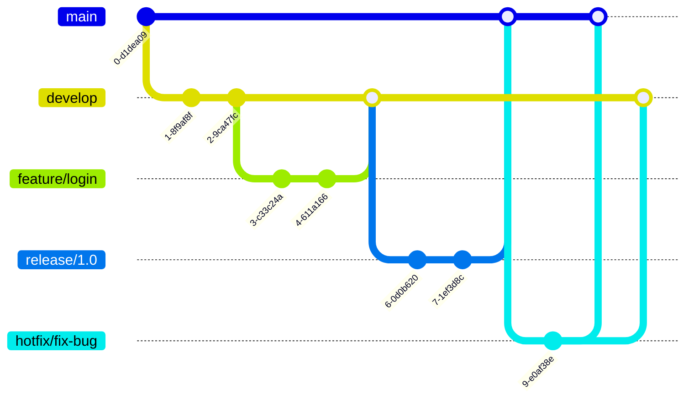

import { CircleCheck, CircleX, TriangleAlert } from "lucide-react"

### Introduction

Branching allows developers to work on new features, fixes, or experiments without affecting the main codebase. A clear workflow ensures smoother collaboration, fewer merge conflicts, and a consistent project structure.

-----

### Why Branching Matters

  * **Keeps the main branch stable:** The `main` branch always contains a stable, deployable version of the code. All new work happens in separate branches.
  * **Enables multiple contributors to work in parallel:** Teams can work on different tasks simultaneously without interfering with each other's code.
  * **Simplifies reviewing and testing:** Changes are isolated in a branch, making it easy for others to review and test them before they are merged into the main codebase.
  * **Encourages a cleaner commit history:** Each branch tells a story about a specific feature or fix, leading to a more organized and readable project history.

-----

### Common Branching Models

#### 1\. **Feature Branching**

This is the simplest and most common model. Each new feature or fix gets its own branch, created from `main`. Once the work is complete, the feature branch is merged back into `main`.

**Example:**

```bash
git checkout -b feature/add-login-page
```

  * <CircleCheck className="inline h-4 w-4 text-green-500" /> **Keeps features isolated:** Prevents new code from affecting the main branch until it's ready.
  * <CircleCheck className="inline h-4 w-4 text-green-500" /> **Easier to review and test:** Changes are contained, making them simple to validate.
  * <TriangleAlert className="inline h-4 w-4 text-yellow-500" /> **Avoid long-lived branches:** Branches that exist for a long time can lead to complex merge conflicts. **Rebase** regularly with `main` to keep your branch up-to-date.

#### 2\. **GitFlow Workflow**

A more structured model designed for larger projects with planned release cycles. It uses two main long-lived branches: `main` (for stable, production-ready code) and `develop` (for active development).

**Key Branches:**

  * `main`: Contains the production-ready code.
  * `develop`: The integration branch for new features.
  * `feature/*`: Branches for new features, branched from `develop`.
  * `release/*`: Branches for preparing a new production release.
  * `hotfix/*`: Branches for quickly patching bugs in the production code.

**Diagram:**



**Pros:** Great for large teams with multiple planned releases.
**Cons:** Can be overly complex for smaller projects with a continuous delivery model.

#### 3\. **Trunk-Based Development**

All developers work off a single `main` (or `trunk`) branch.

  * **Small, frequent commits:** Changes are merged directly into `main` after passing automated testing.
  * <CircleCheck className="inline h-4 w-4 text-green-500" /> **Encourages fast iteration:** Allows for continuous integration and continuous delivery (CI/CD).
  * <CircleCheck className="inline h-4 w-4 text-green-500" /> **Ideal for CI/CD environments:** Works seamlessly with automated build and deployment pipelines.
  * <TriangleAlert className="inline h-4 w-4 text-yellow-500" /> **Requires discipline:** All changes must be small, and the team needs strong test coverage to prevent breaking the build.

-----

### Forks vs. Branches — When to Use What

When you contribute to a project, you'll either work in a branch or a fork. The choice depends on your permissions.

| Scenario | Use Branch | Use Fork |
| :--- | :--- | :--- |
| **Within a team-owned repo** | <CircleCheck className="inline h-4 w-4 text-green-500" /> | <CircleX className="inline h-4 w-4 text-red-500" /> |
| **Contributing to an external open-source project** | <CircleX className="inline h-4 w-4 text-red-500" /> | <CircleCheck className="inline h-4 w-4 text-green-500" /> |
| **Private collaboration** | <CircleCheck className="inline h-4 w-4 text-green-500" /> | <CircleCheck className="inline h-4 w-4 text-green-500" /> (optional) |

**Tip:** Forks are the standard for public open-source contributions. They provide a personal workspace and prevent new contributors from having direct write access to the upstream repository.

-----

### Best Practices

  * **Keep branch names descriptive:** Use a clear and consistent naming convention, like `fix/navbar-overlap`, `docs/update-readme`, or `feature/add-auth`.
  * **Rebase your branch with `main` before opening a PR:** This ensures your branch has the latest changes and helps you resolve conflicts locally.
    ```bash
    git fetch origin
    git rebase origin/main
    ```
  * **Delete merged branches regularly:** Keep your repository clean by removing branches that have been merged.
  * **Keep changes small and focused:** Each branch should address a single concern.
  * **Never commit directly to `main`:** Use a pull request workflow to ensure all changes are reviewed.

-----

### Recommended Workflow for Open Source

1.  **Fork** the repository you want to contribute to.
2.  **Clone** your fork locally.
3.  Create a new feature branch from `main`.
4.  Make and commit your changes.
5.  **Rebase** or merge with the latest `main` to resolve any conflicts.
6.  **Push** your branch and **open a Pull Request** to the original repository.
7.  Respond to feedback and merge after a successful review.

-----

### Summary

Choosing the right branching strategy depends on the project's scale and team size:

  * **Small projects:** Simple feature branches or trunk-based development.
  * **Larger teams:** GitFlow or a hybrid approach.

A consistent workflow improves collaboration and code quality across the open-source community.
