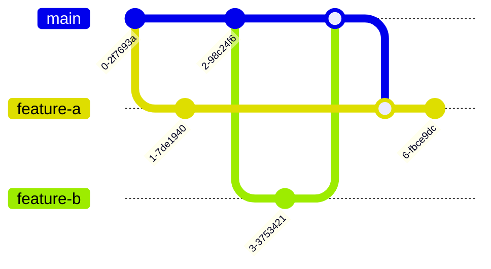

# Introduction

Merge conflicts happen when Git cannot automatically reconcile changes between branches. Understanding and resolving them is a crucial skill for smooth collaboration in any project.

-----

## 1\. What Is a Merge Conflict?

A **merge conflict** occurs when two branches have overlapping changes that Git cannot automatically combine. Git is smart, but it can't read your mind. When it sees two different edits to the exact same part of a file, it stops and asks you to decide which changes to keep.

Common scenarios where conflicts happen:

  * **The same line is edited in two different branches:** This is the most common type of conflict.
  * **A file is deleted in one branch but modified in another:** Git doesn't know whether to keep the changes or delete the file.
  * **Renamed files or moved directories:** If a file is moved in one branch but edited in another, Git can sometimes get confused.

-----

## 2\. How to Detect Conflicts

Git will immediately notify you when a merge conflict occurs. You'll see a message in your terminal indicating which files are in conflict.

**During a merge:**

1.  Start a merge:
    ```bash
    git checkout main
    git merge feature/add-login
    ```
2.  Git will stop and output a message similar to this:
    ```bash
    Auto-merging src/App.tsx
    CONFLICT (content): Merge conflict in src/App.tsx
    Automatic merge failed; fix conflicts and then commit the result.
    ```
3.  When you open the conflicted file, you'll see special markers that Git adds to highlight the conflicting code.

Here's a visual example of what you'll see inside your file:

```text
<<<<<<< HEAD
Current branch code (what you have on 'main')
=======
Incoming branch code (what's on 'feature/add-login')
>>>>>>> feature/add-login
```

  * `<<<<<<< HEAD`: The code from your current branch (`main`).
  * `=======`: A separator between the two conflicting versions.
  * `>>>>>>> feature/add-login`: The code from the branch you're trying to merge (`feature/add-login`).

-----

## 3\. Resolving Conflicts Manually

Resolving a conflict is a hands-on process where you act as the decision-maker.

1.  **Open the conflicted file** in your code editor.
2.  **Manually edit the file:** Decide which changes to keep. You can keep one side, combine parts of both, or even rewrite the entire section. Remove all of the `<<<<<<<`, `=======`, and `>>>>>>>` conflict markers.
3.  **Stage the resolved files:** Once you've fixed all the conflicts in a file, you must tell Git that it's ready.
    ```bash
    git add src/App.tsx
    ```
4.  **Continue the merge:** After you've resolved and staged all conflicted files, you can finalize the merge.
    ```bash
    git commit
    ```
    This will open a new commit message for the merge. You can use the default message or edit it to be more descriptive.

-----

## 4\. Resolving Conflicts with Tools

For a more visual and user-friendly experience, you can use built-in tools or external applications to resolve conflicts.

  * **VS Code:** It has a fantastic built-in merge conflict editor. When you open a conflicted file, it will display "Accept Current Change," "Accept Incoming Change," and "Accept Both Changes" buttons, making the process point-and-click.
  * **Git GUI tools:** Applications like GitKraken, Sourcetree, and Fork provide a visual way to compare changes and resolve conflicts side-by-side without touching the command line.
  * **CLI tools:** You can also use `git mergetool`, which will launch an external merge tool (like Meld or KDiff3) to help you resolve the conflicts.


```bash
# Launch a visual merge tool
git mergetool

# After resolving, the tool will close. Then, commit the result.
git commit
```

-----

## 5\. Rebasing and Conflicts

Conflicts also appear when you `rebase` a branch, which is a common practice for keeping a clean, linear history. The resolution process is similar but requires a different command to continue.

```bash
# Bring your branch up-to-date with the main branch
git fetch origin
git rebase origin/main
```

If a conflict occurs, you resolve it just as you would with a merge. After fixing the conflicted file and staging it with `git add`, you use `git rebase --continue` to proceed.

```bash
# After resolving conflicts in a file
git add src/App.tsx

# Continue the rebase process
git rebase --continue
```

This process repeats for each conflict in your rebased commits. While it takes more care, the advantage is a cleaner commit history, which can make debugging easier.

-----

## 6\. Preventing Merge Conflicts

The best way to handle conflicts is to prevent them from happening in the first place.

  * **Pull/rebase frequently:** Regularly sync your local branches with the `main` branch to stay up-to-date. The sooner you see a conflict, the easier it is to resolve.
  * **Keep PRs small and focused:** A pull request that does one thing is less likely to overlap with another contributor's work.
  * **Communicate with teammates:** If you're working on a large change, let your team know. This helps avoid multiple people working on the same code.

Here's a diagram illustrating a conflict that could be avoided by regular syncing:



In this diagram, `commit B` and `commit D` were made concurrently on different branches, causing a conflict when `feature-a` is merged into `main` after `feature-b`.

-----

## 7\. Summary

Merge conflicts are a normal part of a collaborative Git workflow—they're a sign of concurrent work. Resolve them carefully, test your changes thoroughly, and communicate if you're unsure. By frequently syncing your branches and keeping your contributions small, you can significantly reduce the number of conflicts you encounter.
